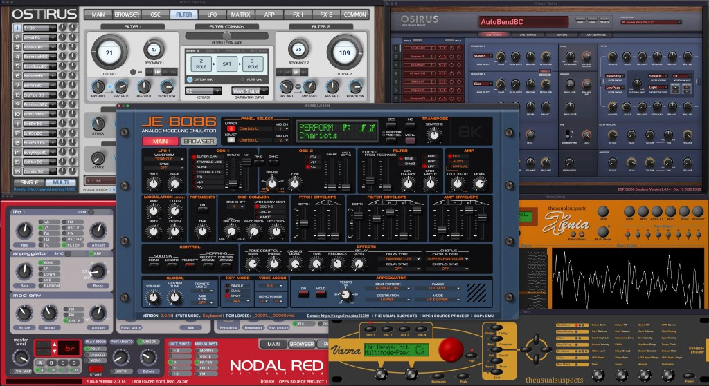
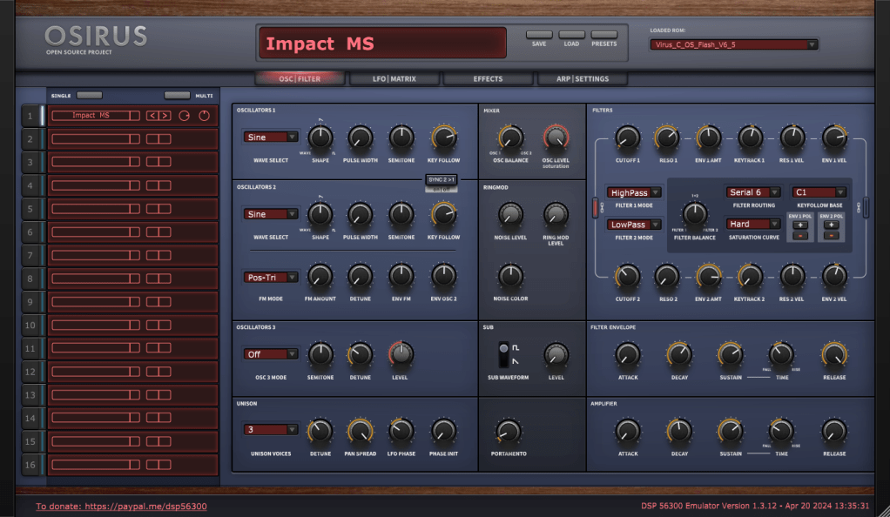

```
██╗    ██╗███████╗██╗      ██████╗ ██████╗ ███╗   ███╗███████╗
██║    ██║██╔════╝██║     ██╔════╝██╔═══██╗████╗ ████║██╔════╝
██║ █╗ ██║█████╗  ██║     ██║     ██║   ██║██╔████╔██║█████╗  
██║███╗██║██╔══╝  ██║     ██║     ██║   ██║██║╚██╔╝██║██╔══╝  
╚███╔███╔╝███████╗███████╗╚██████╗╚██████╔╝██║ ╚═╝ ██║███████╗
 ╚══╝╚══╝ ╚══════╝╚══════╝ ╚═════╝ ╚═════╝ ╚═╝     ╚═╝╚══════╝
```



Welcome to our site, dedicated to the emulation of classic digital synthesizers and effects processors.

We are The Usual Suspects, a dedicated group of people who are currently Reverse Engineering and Emulating various DSP processors that have been used in the design and implementation of digital musical instruments and effects processors over the years.

We began with the Motorola DSP563XX series of processors, which were used in many virtual analogue synthesizers and other musical gear that was released after around the mid 90s, such as Access Virus A, B, C, TI / Clavia Nord Lead 2X, 3, Modular / Waldorf Q, Microwave II / Novation Supernova, Nova and many others.  
  
We have since broadened our horizons and are branching out to research and realize emulations of many other DSP processing platforms, whether they are well-known or maybe even some that are bespoke and/or custom in nature.

Want to be part of the community? Join us on Discord: [https://discord.gg/WJ9cxySnsM](https://discord.gg/WJ9cxySnsM)



Here is a video of our JE8086 emulator in action, you can grab a copy of our various emulators from our downloads pages on the menu bar.

<div class="video-container"><iframe width="1000" height="563" src="https://www.youtube.com/embed/7VPrG5RHwGg" title="The Usual Suspects - JE-8086 Emulator Demo" frameborder="0" allow="accelerometer; autoplay; clipboard-write; encrypted-media; gyroscope; picture-in-picture; web-share" referrerpolicy="strict-origin-when-cross-origin" allowfullscreen></iframe></div>

# Examples of Media about our Project

[JE-8086: Roland DSP emulator insights and the Supersaw is no longer a mystery](https://synthanatomy.com/2026/01/je-8086-roland-dsp-emulator-insights-and-the-supersaw-is-no-longer-a-mystery.html)

[YouTube: 39C3 - From Silicon to Darude Sand-storm: breaking famous synthesizer DSPs](https://www.youtube.com/watch?v=XM_q5T7wTpQ&t=1s)

[JE-8086 by The Usual Suspects - A Roland JP-8000 Emulator](https://produceralley.com/je-8086-by-the-usual-suspects-a-roland-jp-8000-emulator/)

[The Usual Suspects Nodal Red 2x, free Nord Lead 2 emulation using the DSP56300 plugin, now in public beta](https://synthanatomy.com/2025/01/the-usual-suspects-nodal-red-2x-free-nord-lead-2-emulation.html)

[OsTIrus Is A FREE Virus Ti Emulator By The Usual Suspects](https://bedroomproducersblog.com/2024/04/23/ostirus/)

[Youtube: The truth about OsTirus (DSP56300)](https://www.youtube.com/watch?v=m2qu3ORelH4)

[Xenia (Waldorf Microwave XT Emulator) Coming from DSP56300](https://www.matrixsynth.com/2024/04/xenia-waldorf-microwave-xt-emulator.html?m=1)

[DSP56300 Xenia and OsTirus, new Waldorf Microwave XT, and Access Virus TI Synthesizer emulators are coming soon to your DAW.](https://synthanatomy.com/2024/04/dsp56300-xenia-and-ostirus-waldorf-microwave-xt-access-virus-ti-emulators.html)

[Youtube: Classic Synths for FREE???](https://www.youtube.com/watch?v=2Mf2bWSbjh0)

[The Usual Suspects Vavra, a Waldorf microQ emulation using the DSP56300 plugin](https://synthanatomy.com/2023/04/the-usual-suspects-vavra-a-waldorf-microq-emulation-using-the-dsp56300-plugin.html)

[Do You Want Emulations Of All Your Favourite Digital Synths?](https://www.pro-tools-expert.com/production-expert-1/do-you-want-emulations-of-all-your-favourite-digital-synths)

[DSP56300 Emulator to Bring Emulations of Classic Access, Clavia, Waldorf, and Novation Synths](https://www.matrixsynth.com/2021/07/dsp56300-emulator-to-bring-emulations.html)

[This ‘synth emulator’ plugin could bring the Access Virus, Nord Lead and Waldorf Q to your DAW, but there is a catch](https://www.musicradar.com/news/synth-emulator-plugin)

# Donations

If you like what we are doing feel free to buy us a Coffee:

[](https://www.paypal.com/donate?hosted_button_id=XMSX46LBRWNLG)

Bitcoin: bc1qhfc7kuzznvc9nulcmuup5thvrcgzhypqquf9n9  
  
Ethereum: 0xe0aE1CeC430bc0BAd1ABf86684EA38a7666A1125  
  
Litecoin: LTiZbcJZfby2TxtXwmkf3RjA7C7qnijVzG
